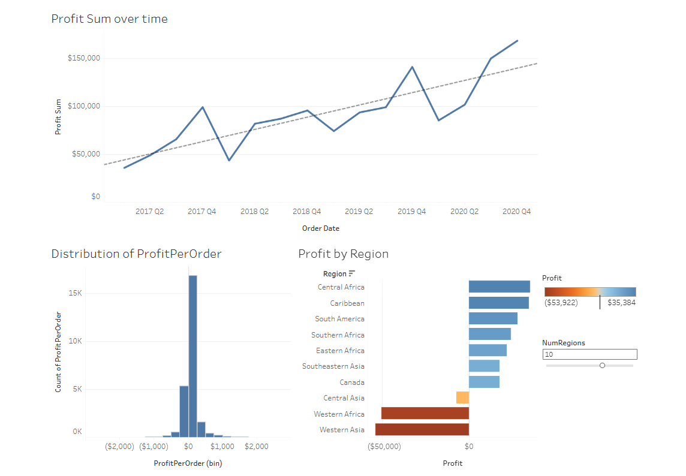
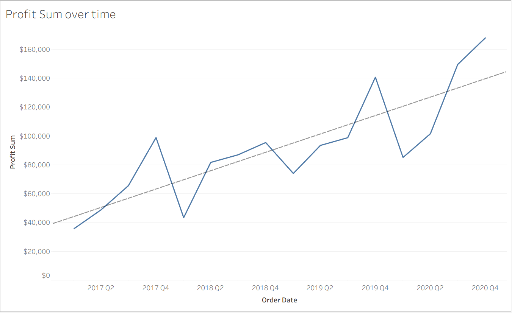
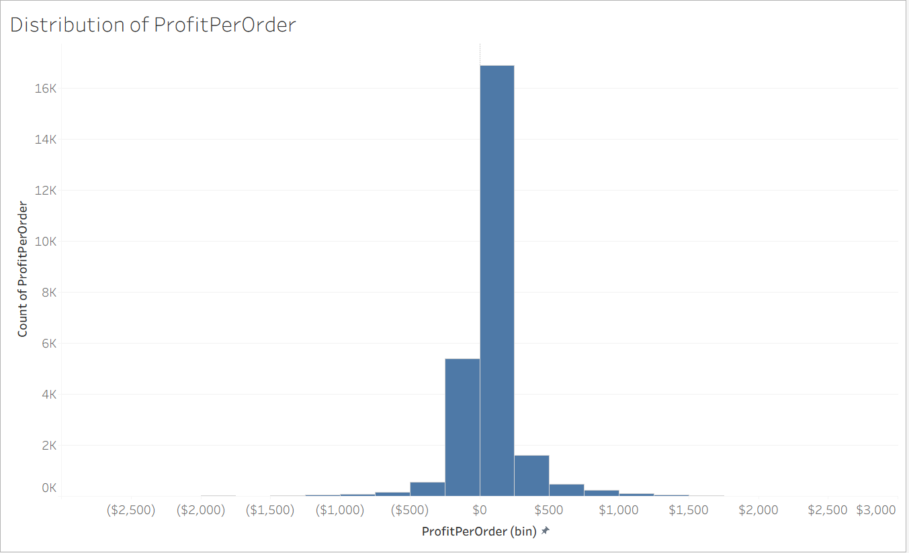
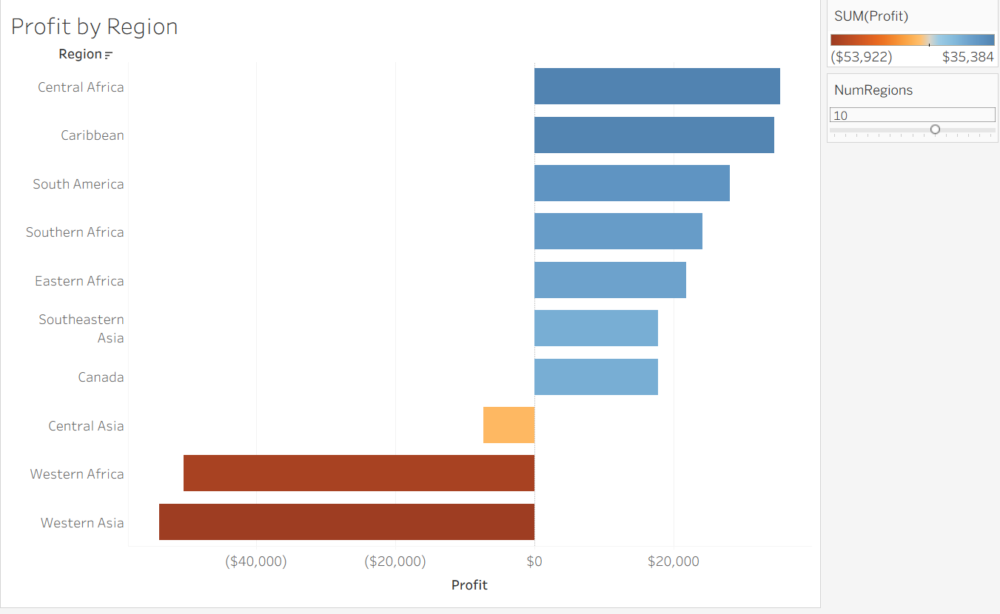

# Global Superstore Profitability Analysis

Interactive Tableau dashboard analyzing profit trends, order-level profit distribution, and regional profitability across Global Superstore orders and returns data from 2017 to 2020.

## Live Dashboard
[View on Tableau Public](https://public.tableau.com/app/profile/shivachethan.reddy.peri/viz/global-superstore-profits-insights/Dashboard)

## Dashboard Preview

## Business Problem
A global retail business needs to understand how profitability changes over time, how profit is distributed across orders, and which regions are underperforming in order to identify margin risks and improve decision-making.

## Data Source
- Orders dataset: Global Superstore Orders 2021
- Returns dataset: Global Superstore Returns 2021
- Order records: 51,290
- Return records: 1,079
- Date range: 2017-01-01 to 2020-12-31
- Distinct orders: 25,728
- Regions: 23
- Total sales: $12,642,507.25
- Total profit: $1,467,456.67

## Tools Used
- Tableau Desktop / Tableau Public
- CSV and Excel data sources
- Interactive dashboard filtering
- Trendline, histogram, and regional profit analysis

## Dashboard Components

### 1. Profit Sum over Time

This chart shows an overall upward trend in quarterly profit despite noticeable short-term fluctuations.

### 2. Distribution of Profit Per Order

The histogram shows that most orders generate profits or losses within a relatively narrow range near zero, while extreme values are uncommon.

### 3. Profit by Region

This chart highlights profitable and loss-making regions, clearly showing Western Asia, Western Africa, and Central Asia as negative-profit regions.

### 4. Interactive Dashboard

The dashboard combines trend, distribution, and regional analysis with an interactive region filter for deeper exploration.

## Key Insights
- Profit increased overall from 2017 to 2020.
- Quarterly profit reached its highest level in late 2020.
- Most orders have small profit or loss values close to zero.
- Only three regions show negative total profit: Western Asia, Western Africa, and Central Asia.
- Western Asia and Western Africa are the weakest-performing regions by total profit.

## Preattentive Attributes Used
- Length and position in the regional bar chart to compare profit across regions
- Position and slope in the time series to show the profit trend
- Bar height in the histogram to emphasize concentration around zero
- Color to distinguish positive and negative regional performance

These visual choices improve scanability and help underperforming regions stand out immediately.

## Files Included
- Tableau dashboard screenshot
- Supporting chart screenshots
- Tableau packaged workbook (.twbx)
- Orders dataset (.csv)
- Returns dataset (.xlsx)
