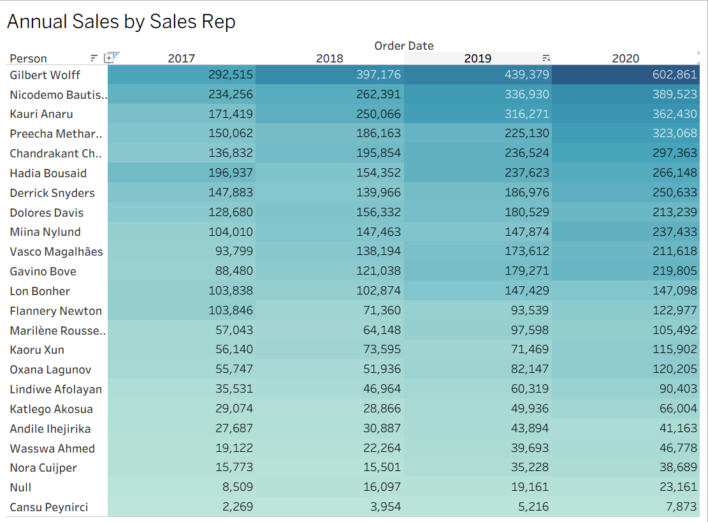
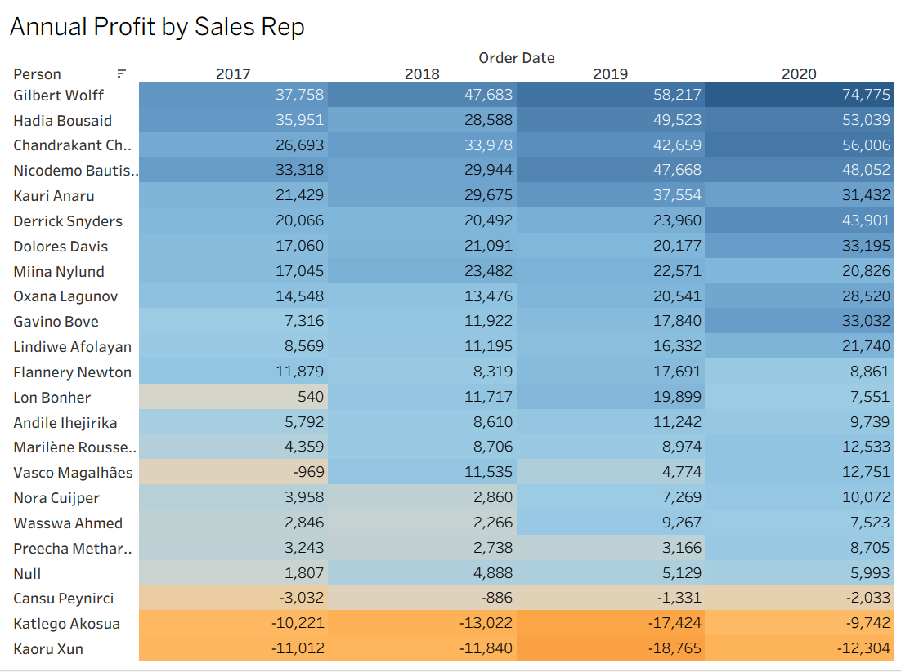
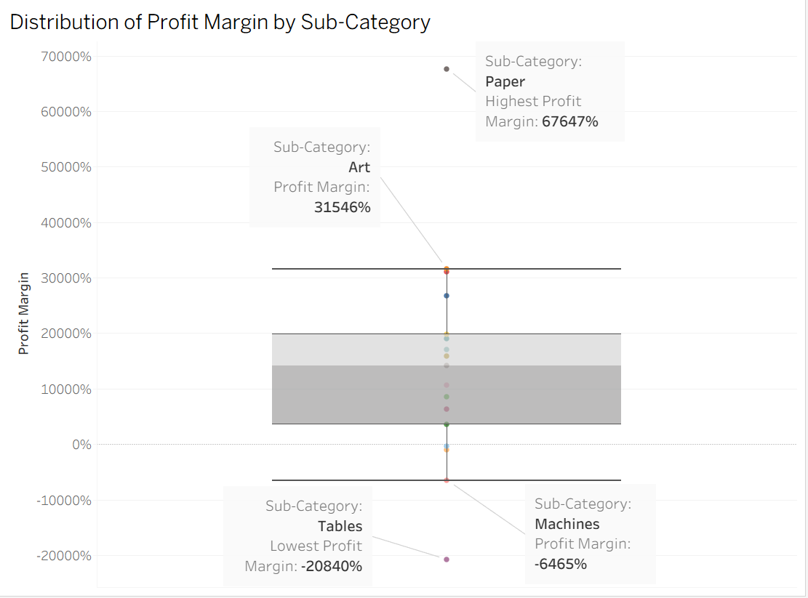

# Global Superstore Sales Rep and Profitability Performance Analysis

Tableau analysis of sales rep performance, profitability trends, and sub-category margin behavior using Global Superstore orders, returns, and sales rep mapping data.

## Live Visualizations
- [Annual Sales by Sales Rep](https://public.tableau.com/app/profile/shivachethan.reddy.peri/viz/AnnualSalesbySalesRep/SalesHeatmap?publish=yes)
- [Annual Profit by Sales Rep](https://public.tableau.com/app/profile/shivachethan.reddy.peri/viz/AnnualProfitbySalesRep/ProfitHeatmap?publish=yes)
- [Profit Margin by Sub-Category](https://public.tableau.com/app/profile/shivachethan.reddy.peri/viz/ProfitMarginbySub-Category_17757979485210/Box-and-WhiskersPlot?publish=yes)

## Business Problem
A sales manager needs to understand which sales representatives are driving revenue growth, whether strong sales performance is translating into profit, and which product sub-categories are weakening overall profitability.

## Data Source
- Orders dataset: Global Superstore Orders 2021
- Returns dataset: Global Superstore Returns 2021
- Sales rep mapping dataset: SalesReps
- Order records: 51,290
- Return records: 1,079
- Sales rep mapping rows: 24
- Date range: 2017-01-01 to 2020-12-31
- Distinct orders: 25,728
- Sub-categories: 17
- Total sales: $12,642,507.25
- Total profit: $1,467,456.67

## 1. Annual Sales by Sales Rep

This heatmap shows year-over-year sales growth across sales representatives and highlights the strongest performers.

## 2. Annual Profit by Sales Rep

This chart shows that higher sales do not always translate into stronger profitability for each representative.

## 3. Profit Margin by Sub-Category

This plot highlights the variation in profit margins across sub-categories and helps identify strong and weak categories.

## Key Insights
- Several top sales representatives show strong year-over-year sales growth.
- Gilbert Wolff is the top sales performer and reached about $602,861 in 2020 sales.
- Profit performance does not always track sales performance evenly across reps.
- Kaoru Xun and Katlego Akosua are among the weakest profit performers in multiple years.
- Tables is the weakest sub-category by total profit.
- Paper and Art show strong margin potential, while Tables and Machines require review.

## Recommended Actions
- Review pricing, discounts, and cost structure for weak-margin categories.
- Investigate sales reps or territories where sales are growing but profits remain weak.
- Use top-performing reps as benchmarks for strategy and account management.
- Analyze whether returns are contributing to weak profitability in specific areas.

## Files Included
- Tableau workbook (.twbx)
- Orders data (.xlsx)
- Returns data (.csv)
- Sales rep mapping (.xlsx)
- Screenshot files
