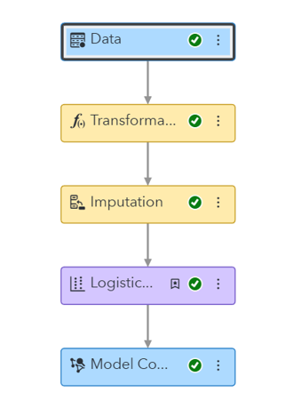
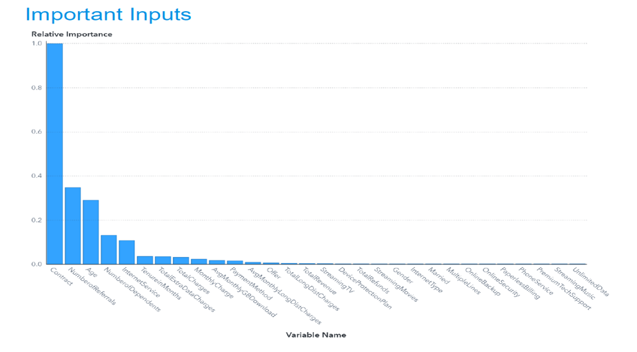
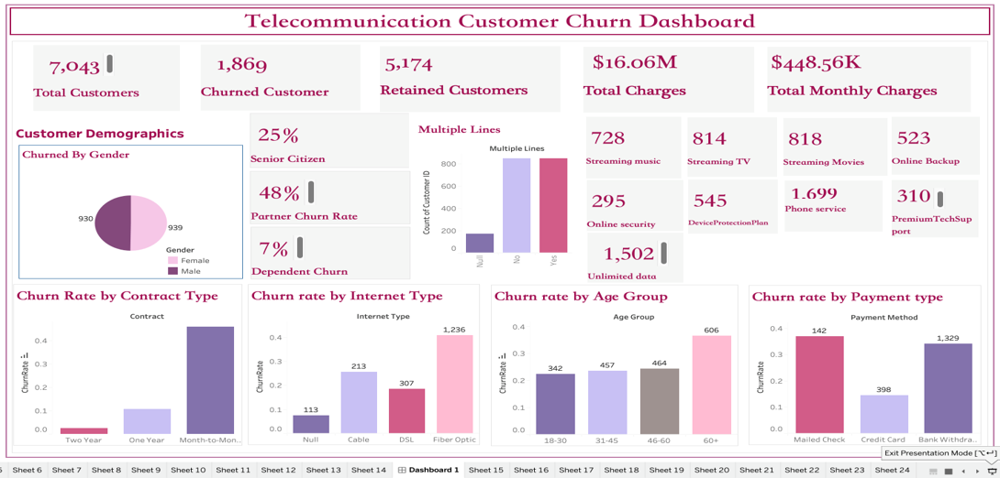

# Telecom Customer Churn Analytics and Retention Strategy

This project is a full analytics case study focused on understanding, predicting, and reducing telecom customer churn. It combines data cleaning, missing value treatment, exploratory data analysis, predictive modeling, risk segmentation, dashboarding, and business recommendatding, predicting, and reducing telecom customer churn. It combines data cleaning, missing vject was to identify key drivers of customer churn for Maven Communications and translate those findings into measurable business actions. The analysis combined Tableau, Power BI, Python, and SAS Viya to build both diagnostic dashboards and predictive churn segmentation for better decision-making.

## Business Problem
Customer churn creates major revenue loss for telecom providers. Without early insight into high-risk customers, retention efforts become reactive and inefficient. This project was designed to help leadership identify churn drivers, monitor churn patterns, and target retention campaigns more effectively.

## Dataset Overview
- Dataset: Telecom Customer Churn
- Total customer records: 7,043
- Churned customers: 1,869
- Retained customers: 5,174
- Supporting geography data: Zip code population
- Data categories:
  - Demographics
  - Customer tenure and account details
  - Service subscriptions
  - Payment behavior
  - Financial measures
  - Churn category and churn reason

## Tools and Technologies
- Tableau
- Power BI
- Python
- SAS Viya
- Excel / CSV

## Analytics Workflow

### 1. SAS Viya Modeling Pipeline

This workflow shows the end-to-end modeling pipeline used in SAS Viya, including data input, transformation, imputation, logistic regression, and model comparison.

### 2. Power BI Customer Churn Dashboard

The Power BI dashboard was designed to provide KPI monitoring and interactive churn analysis across customer demographics, services, contracts, payment methods, and age groups.

### 3. Model Input Importance

This feature importance chart highlights the strongest model drivers, with contract type, number of referrals, age, number of dependents, and tenure among the most influential predictors.

### 4. Tableau Customer Churn Dashboard

The Tableau dashboard provided an additional visualization layer for churn analysis, helping stakeholders explore churn patterns by customer attributes and service usage.

## Analytical Approach
The project followed a complete analytics process:
1. Cleaned and standardized telecom customer data.
2. Performed imputation for missing or inconsistent fields.
3. Conducted exploratory analysis on churn by demographics, contracts, payment method, internet type, and tenure.
4. Built a logistic regression model in SAS Viya to identify statistically significant churn drivers.
5. Segmented customers into low-, medium-, and high-risk groups using predicted churn probabilities.
6. Presented the findings through dashboards and business recommendations.

## Key Insights
- Month-to-month contracts are the strongest churn risk segment.
- Customers with high monthly charges show much greater churn risk.
- Fiber optic customers represent one of the highest churn groups.
- Senior customers, especially age 60+, have elevated churn levels.
- Add-on services such as online security, backup, and premium tech support appear protective against churn.
- Longer-tenure customers are substantially less likely to churn.
- Payment behavior matters, with mailed-check users showing higher churn than digital payment users.

## Model Results
- Logistic regression identified 13 important churn predictors.
- Model fit improved by about 37% compared with baseline.
- The project created three actionable risk tiers:
  - Low Risk: 2,817 customers with 1.4% average churn probability
  - Medium Risk: 2,817 customers with 26.8% average churn probability
  - High Risk: 1,409 customers with 75.7% average churn probability

## Business Recommendations
- Reduce month-to-month churn with contract upgrade incentives and retention offers.
- Improve experience and service quality for fiber optic customers.
- Launch senior-focused plans and support options for older customers.
- Promote auto-pay and digital billing to reduce churn associated with payment friction.
- Upsell customers into bundles and protective add-on services such as backup, security, and premium support.

## Why This Project Matters
This project demonstrates more than dashboard design. It shows the ability to combine business intelligence, predictive analytics, feature importance interpretation, customer risk segmentation, and strategic recommendation design in one end-to-end workflow.

## Files Included
- Project report
- Presentation slides
- Raw churn dataset
- Cleaned churn dataset
- Data dictionary
- Zip code population support files
- Analytics workflow and dashboard screenshots
